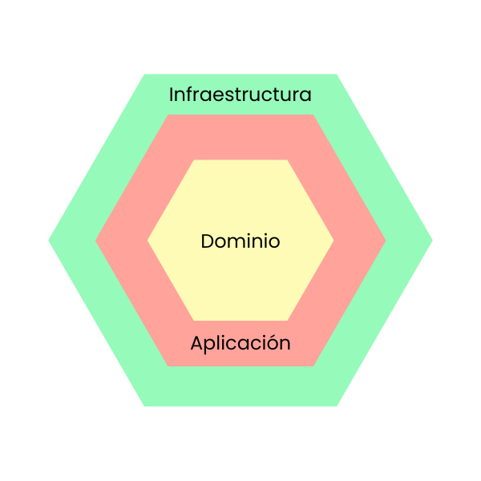

# App seguimiento de películas

## Contenidos
- [Descripción](#descripción)
- [Tecnologías](#tecnologías)
- [Instrucciones](#instrucciones)
- [Arquitectura](#arquitectura)
- [Contribuir](#contribuir)

## Descripción
La aplicación permite:
- Llevar un seguimiento de las películas que has visto, estás viendo y quieres ver.
- Agregar, editar y eliminar películas.
- Filtrar películas por estado (vista, viendo, pendiente).
- Buscar películas por nombre.
- Ver el detalle de una película.
- Marcar una película como vista o viendo.

## Tecnologías
- Spring Boot
- Java 17
- Maven
- MySQL
- Arquitectura Hexagonal
## Arquitectura



- **Capa de Dominio**:
    - Model: 
      - Contiene las entidades (`User`, `Movie`).
    - Port:
      - Define los puertos, o interfaces, que exponen la funcionalidad del dominio (entrada) y las dependencias hacia afera (salida).
        - input.MovieService: Define los casos de uso relacionados con las películas.
        - output.MovieRepositoryPort: Define las operaciones que se pueden realizar sobre el repositorio de películas.

- **Capa de Aplicación**: 
  - Esta capa contiene la lógica de orquestación de casos de uso, no la lógica de negocio en sí.
    - service:
        - Aquí van las implementaciones de los casos de uso definidos en los puertos de entrada.
    - dto: 
      - Contiene objetos que se utilizan para transferir datos entre capas.
    - mapper:
      - Contiene clases para transformar entre DTO y modelos de dominio. 

- **Capa de Infraestructura**:
    - Implementa los detalles técnicos necesarios para interactuar con bases de datos, APIs externas, etc.
    - adapter.input.rest: 
      - Contiene los controladores que exponen endpoints REST.
    - adapter.output.repository: 
      - Contiene los adaptadores que implementan los puertos de salida definidos en el dominio.
    - mapper: 
      - Contiene los mapeadores entre entidades de dominio y entidades de base de datos.
    - entity: 
      - Contiene las clases que representan las tablas de la base de datos.
    - config: 
      - Contiene configuraciones específicas, como beans, seguridad, etc.

## Instrucciones
1. **Clonar el repositorio**:
   ```bash
   git clone https://github.com/usuario/repo.git
   cd repo
